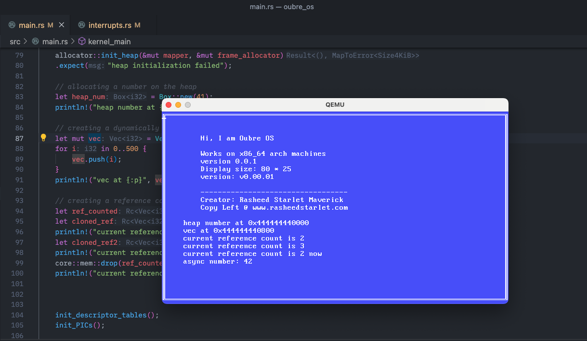

# oubre
Learning to build an Operating System in Rust following this curriculum, https://os.phil-opp.com/

# TUI

# Todo
- Installation Guide
- Compile WASM target machine
- Refactoring 
- Commentary Notes 
- File System
- Shell
- Running processes
- GUI
- etc
